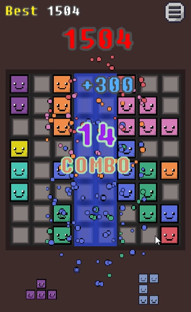
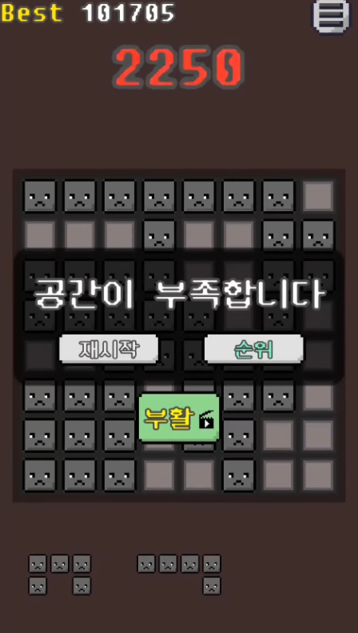
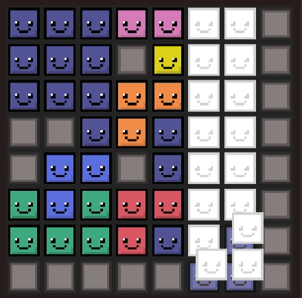

# Pixel Block Puzzle

> **Pixel Block Puzzle**은 Unity 기반 1인 개발 모바일 블록 퍼즐 게임임. 54종의 독특한 블록, 감성 픽셀아트, 콤보/랭킹/광고 시스템 등 다양한 요소를 갖춤.

## 주요 특징
- 8x8 그리드에 다양한 블록을 배치하여 점수 획득
- 54종 블록, 10가지 색상, 픽셀 표정 등 감성적 디자인
- 콤보, 점수, 랭킹(Leaderboard), 보상형 광고(부활) 등 시스템 구현
- 모든 아트(Aseprite)·사운드(Bosca Ceoil) 직접 제작
- Android/원스토어 출시

## 스크린샷

## 다운로드 및 플레이 영상
- [원스토어 다운로드](https://m.onestore.co.kr/ko-kr/apps/appsDetail.omp?prodId=0000781428)
- [Youtube 플레이 영상](https://www.youtube.com/watch?v=osO16h3m1jg)

## 개발 정보
- **엔진/툴**: Unity, Visual Studio Code, Git, Aseprite, Bosca Ceoil
- **개발 인원**: 1인
- **주요 폴더**: `Assets/Scripts/`, `Assets/Sprites/`, `Assets/Sounds/`

## 빌드/실행 방법
1. Unity 2021.3 이상에서 프로젝트 열기
2. Android 플랫폼으로 빌드
3. `Assets/Scenes/Main.unity` 실행

## 라이선스
이 프로젝트는 [MIT License](LICENSE)로 배포됨.
